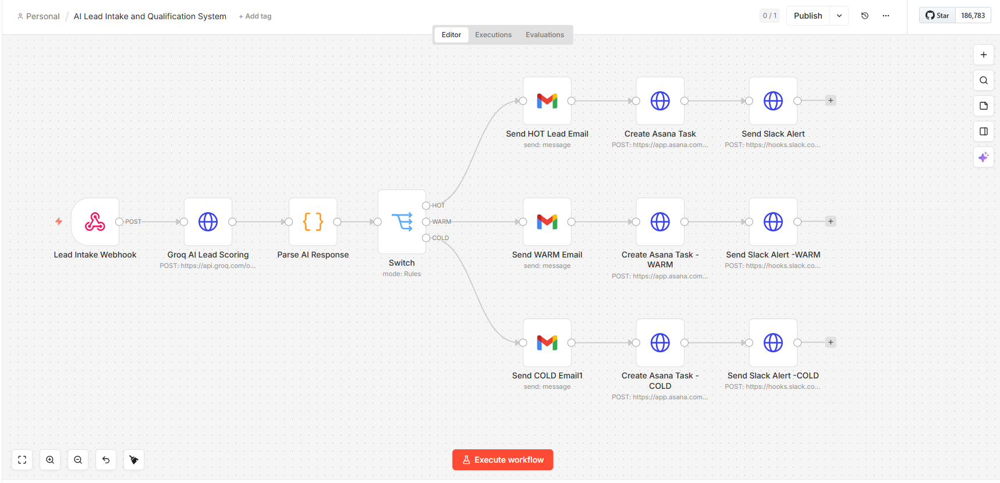
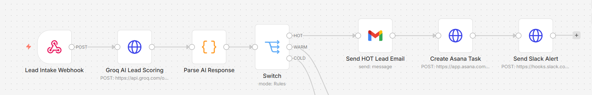
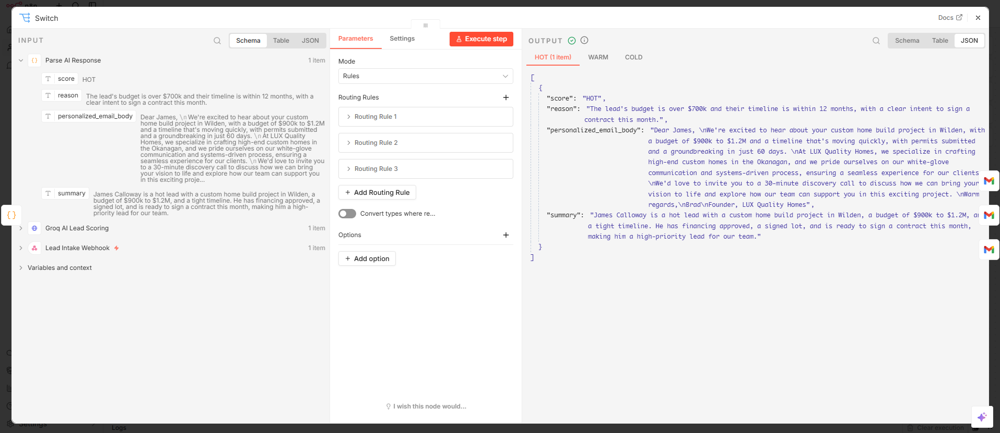
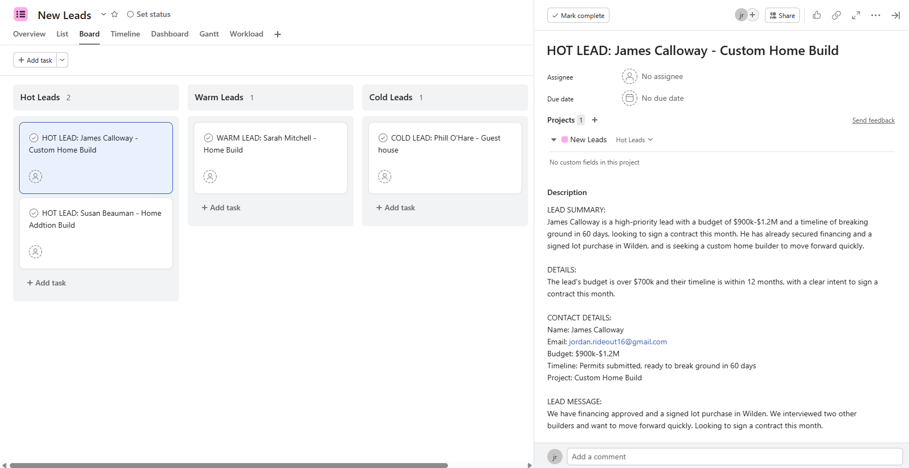
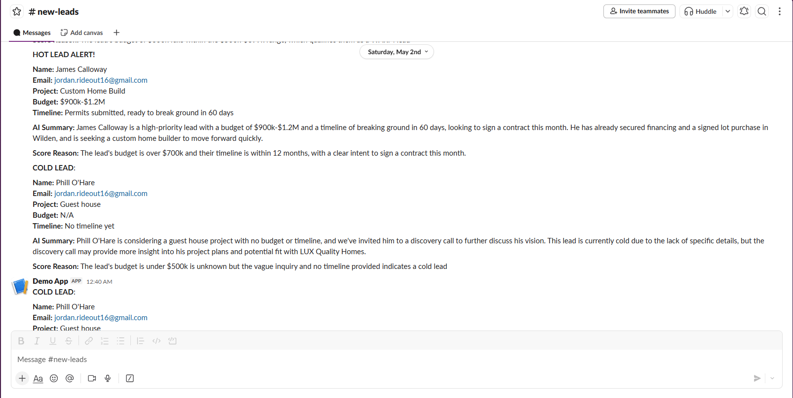
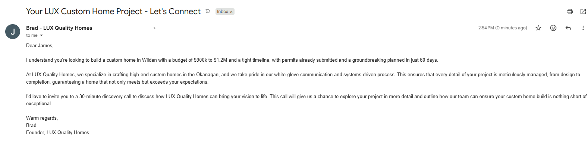

# AI Lead Intake and Qualification System
### Built with n8n | Groq AI | Gmail | Asana | Slack

---

## Canvas Overview



---

## Project Description

A fully automated lead qualification system built in n8n that receives inbound leads via webhook, scores them using an AI model, and routes each lead through a custom path based on score -- without any manual involvement.

When a lead submits their project details, the system sends their information to Groq's LLM API which evaluates the lead against explicit business rules and returns a score (HOT, WARM, or COLD), a reason for the score, a personalised email response written specifically to their project details, and an internal summary for the sales team.

HOT leads trigger a three-action chain: a personalised Gmail response, an Asana task created directly into the Hot Leads board section, and a Slack alert with full lead details. WARM leads follow the same path into their own Asana section with a separate Slack notification. COLD leads receive a personalised email only -- no Slack or Asana clutter for low-value inquiries.

This architecture reflects a real operational decision: keeping Asana and Slack clean for leads that actually require action.

---

## Tools and Integrations

| Tool | Role |
|---|---|
| n8n | Workflow automation platform |
| Groq API (llama-3.3-70b-versatile) | AI lead scoring and email generation |
| Gmail (OAuth2) | Outbound client email |
| Asana API | Task creation with section targeting |
| Slack Webhook | Internal team alerts |
| Hoppscotch | Webhook testing |

---

## Workflow Architecture

```
Webhook Trigger
    └── Groq AI Lead Scoring (HTTP Request)
            └── Parse AI Response (JavaScript Code Node)
                    └── IF Node: score = "HOT"?
                            ├── TRUE → Send HOT Email → Create Asana Task (Hot Section) → Slack HOT Alert
                            └── FALSE → IF Node: score = "WARM"?
                                            ├── TRUE → Send WARM Email → Create Asana Task (Warm Section) → Slack WARM Alert
                                            └── FALSE → Send COLD Email
```

---

## Groq System Prompt

```
You are a lead qualification assistant for LUX Quality Homes, a premium custom home builder
in Kelowna BC. Return a structured JSON response only, no other text.

SCORING RULES - follow these exactly:
HOT = budget $700k+ AND timeline within 12 months AND message shows clear intent
(financing, signed lot, competitor comparison, ready to sign).
WARM = budget $500k-$699k OR timeline 12-24 months OR message shows interest but no urgency.
COLD = budget under $500k OR timeline beyond 24 months OR vague inquiry.

Return exactly this JSON:
{
  "score": "HOT" or "WARM" or "COLD",
  "reason": "one sentence referencing the specific rule that applied",
  "personalized_email_body": "Paragraph 1: acknowledge their specific project type, budget,
  and timeline. No generic openers.\n\nParagraph 2: establish LUX credibility - high-end
  custom homes in the Okanagan, white-glove communication, systems-driven process.\n\n
  Paragraph 3: invite them to a 30 minute discovery call at [CALENDLY_LINK].\n\n
  Warm regards,\nBrad\nFounder, LUX Quality Homes",
  "summary": "2 sentence internal summary for the sales team"
}
```

---

## Email Templates

### HOT and WARM Lead Email
AI-generated dynamically per lead. The email body is written by Groq based on the lead's
specific project type, budget range, timeline, and message. No static template -- every
email is unique to the recipient.

**Subject line:** `Your LUX Custom Home Project - Let's Connect`

### COLD Lead Email
Also AI-generated. Same personalisation logic, different tone -- warmer and lower pressure,
no urgency language.

**Subject line:** `Thanks for reaching out to LUX Quality Homes`

---

## Asana Integration Detail

Tasks are created using the Asana REST API via HTTP Request node with a personal access
token. The `memberships` field in the request body targets the task directly into the
correct board section at creation time -- no secondary API call required.

```json
{
  "data": {
    "name": "HOT LEAD: [Client Name] - [Project Type]",
    "notes": "Lead summary, score reason, contact details, and original message",
    "projects": ["YOUR_PROJECT_GID"],
    "memberships": [
      {
        "project": "YOUR_PROJECT_GID",
        "section": "YOUR_SECTION_GID"
      }
    ]
  }
}
```

---

## Slack Notification Format

**HOT Alert:**
```
:fire: HOT LEAD ALERT
Name: [Client Name]
Email: [Email]
Project: [Project Type]
Budget: [Budget Range]
Timeline: [Timeline]

AI Summary: [2 sentence summary from Groq]
Score Reason: [Reason from Groq]
```

**WARM Alert:**
```
:thermometer: WARM LEAD
[Same fields as above]
```

---

## Screenshots

### Full Canvas


### HOT Lead Routing


### Groq Response Output


### Asana Result


### Slack Notification


### Email Output


---

## Files in This Repo

```
├── README.md
├── lead-intake-workflow.json       ← Import directly into n8n
└── screenshots/
    ├── canvas-overview.png
    ├── hot-lead-path.png
    ├── groq-output.png
    ├── asana-result.png
    ├── slack-alert.png
    └── email-output.png
```

---

## Setup Instructions

1. Import `lead-intake-workflow.json` into your n8n instance via the three-dot menu
2. Connect credentials for Gmail (OAuth2), Asana (HTTP Header Auth), and Slack (Webhook URL)
3. Replace placeholder values:
   - `YOUR_GROQ_API_KEY` in the Groq HTTP node Authorization header
   - `YOUR_ASANA_PROJECT_GID` in both Asana node bodies
   - `YOUR_HOT_SECTION_GID` and `YOUR_WARM_SECTION_GID` in the respective Asana nodes
   - `YOUR_SLACK_WEBHOOK_URL` in both Slack node URL fields
4. Activate the webhook and test using the payload below

**Test Payload (HOT lead):**
```json
{
  "name": "James Calloway",
  "email": "test@example.com",
  "project_type": "Custom Home Build",
  "budget_range": "$900k - $1.2M",
  "timeline": "Permits submitted, break ground in 60 days",
  "message": "Financing approved, signed lot in Wilden. Ready to sign a contract this month."
}
```

---

## Key Technical Decisions

**Why Groq instead of OpenAI:** Groq's free tier provides access to llama-3.3-70b-versatile
with fast inference. For portfolio and proof-of-concept builds this eliminates cost while
maintaining output quality comparable to GPT-4o on structured tasks.

**Why explicit scoring rules instead of vague criteria:** Leaving the scoring to model
judgment produces inconsistent results across runs. Encoding hard thresholds (budget
dollar amounts, timeline windows, intent signals) makes the scoring deterministic and
auditable -- a requirement for any real business deployment.

**Why no Asana or Slack for COLD leads:** Operational noise reduction. A real sales team
should not be alerted for every low-budget or vague inquiry. The system filters at the
AI layer so the tools downstream stay clean.

---

*Part of Jordan Rideout's AI Automation Portfolio*
*Built to demonstrate real-world automation capability for operations-focused roles*
